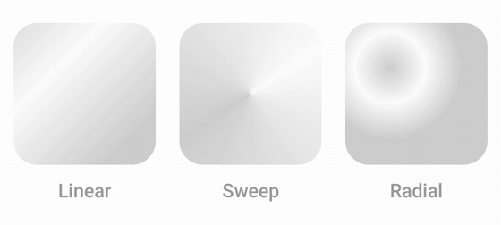

# 🏞️ EasyShimmerCompose
[](https://opensource.org/licenses/Apache-2.0)
[](https://android-arsenal.com/api?level=28)
[](https://jitpack.io/#evergreentree97/easy-shimmer-compose)

<div align="center">
  
</div>

<br>
EasyshimmerCompose is a lightweight library that simplifies adding shimmer effects to your Jetpack Compose applications. Leveraging Coil's image loading capabilities, you can easily apply shimmer effects to images, text, or any other composable using the drawShimmer modifier or rememberShimmerImagePainter.

## ✨ Features

*   **Easy to Use**: Apply shimmer effects effortlessly with the `drawShimmer` modifier or `rememberShimmerImagePainter`.
*   **Composable Versatility**:  Supports shimmer effects on various Composables, including images, text, `Box`, `Row`, and `Column`.
*   **Animation Control**: Customize shimmer effects by adjusting `animationSpec` and `colors` through `ShimmerOptions`.
*   **Gradient Choice**: Draw the shimmer as a linear band, a sweep or a radial highlight with `ShimmerBrush`.
*   **FillMaxWidth Option**: Control the shimmer effect's width to match its parent Composable using the `enableFillMaxWidth` option.
*   **Powered by Coil**: Utilizes Coil for efficient image loading and integration with rememberShimmerImagePainter.

## ⬇️ Download

### Gradle

Add it in your root build.gradle or settings.gradle at the end of repositories:

```kotlin
dependencyResolutionManagement {
    repositoriesMode.set(RepositoriesMode.FAIL_ON_PROJECT_REPOS)
    repositories {
        mavenCentral()
        maven {
            url = uri("https://jitpack.io")
        }
    }
}
```

Add the following dependency to your project's `build.gradle.kts` file:

```kotlin
dependencies {
    implementation("com.github.evergreentree97:easy-shimmer-compose:0.0.2") // Replace with the latest version
}
```

## 🛠️ Usage

### `rememberShimmerImagePainter`

https://github.com/user-attachments/assets/5732027d-4503-4a0f-8f9f-14d1cb91bcd9

`rememberShimmerImagePainter` returns a `Painter` that displays a shimmer effect while an image is loading. Use it with the `Image` composable.

```kotlin
Image(
    modifier = Modifier
        .clip(RoundedCornerShape(20.dp))
        .size(200.dp),
    painter = rememberShimmerImagePainter(imageUrl),
    contentDescription = null,
    contentScale = ContentScale.Crop,
)
```

### `drawShimmer` Modifier

https://github.com/user-attachments/assets/e39de411-ef7b-46a1-8406-ce3933a244a0

The `drawShimmer` modifier applies a shimmer effect to any Composable. You can use it with `Text`, `Box`, `Row`, `Column`, and others.
By default, drawShimmer expands to fill the maximum available width thanks to the enableFillMaxWidth option being set to true. You can adjust the shimmer's size by applying padding to the composable:

```kotlin
// This shimmer effect will have horizontal padding, making it narrower than its parent.
Text(
    modifier = Modifier.drawShimmer(
        visible = text.isBlank(),
    ),
    text = text,
    textAlign = TextAlign.Center,
)
```

### `ShimmerOptions`
You can customize your shimmer effect with `ShimmerOptions`
```kotlin
ShimmerOptions(
    shimmerAnimationSpec = infiniteRepeatable(
        animation = tween(1000, easing = FastOutSlowInEasing),
        repeatMode = RepeatMode.Restart
    ),
    crossFadeAnimationSpec = tween(600),
    colors = listOf(
        Color.Blue,
        Color.Blue.copy(0.5f),
        Color.Blue,
    )
)
```

To change the shimmer everywhere at once, set `ShimmerDefaults.defaultShimmerOptions` on
application startup:

```kotlin
class MyApplication : Application() {
    override fun onCreate() {
        super.onCreate()
        ShimmerDefaults.defaultShimmerOptions = ShimmerOptions(
            // ...
        )
    }
}
```

### `ShimmerBrush`

The `brush` option of `ShimmerOptions` decides how the colors are laid out. `Linear` is the default.

<div align="center">
  
</div>

```kotlin
ShimmerOptions(
    shimmerAnimationSpec = infiniteRepeatable(
        animation = tween(1800, easing = LinearEasing),
        repeatMode = RepeatMode.Restart
    ),
    crossFadeAnimationSpec = tween(600),
    colors = listOf(
        Color(0xFFCFCFCF),
        Color(0xFFFDFDFD),
        Color(0xFFCFCFCF),
    ),
    brush = ShimmerBrush.Sweep,
)
```

`Sweep` reads the colors as a loop, so a palette whose first and last color differ shows a seam
where the two meet.

## 📱 Sample

**For a detailed implementation and example usage, please refer to the `sample` module in the repository.** The sample module demonstrates how to integrate Easyshimmer into your project and showcases various use cases, including customizing `ShimmerOptions` and handling different loading states.

## 🤝 Contributing

Contributions are welcome! Please feel free to submit issues or pull requests.

## ❤️ License

```
Copyright 2025 evergreentree97 (Sangrok Choi)

Licensed under the Apache License, Version 2.0 (the "License");
you may not use this file except in compliance with the License.
You may obtain a copy of the License at

    http://www.apache.org/licenses/LICENSE-2.0

Unless required by applicable law or agreed to in writing, software
distributed under the License is distributed on an "AS IS" BASIS,
WITHOUT WARRANTIES OR CONDITIONS OF ANY KIND, either express or implied.
See the License for the specific language governing permissions and
limitations under the License.
```
